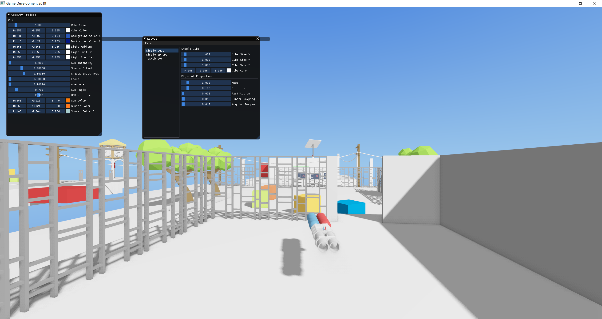
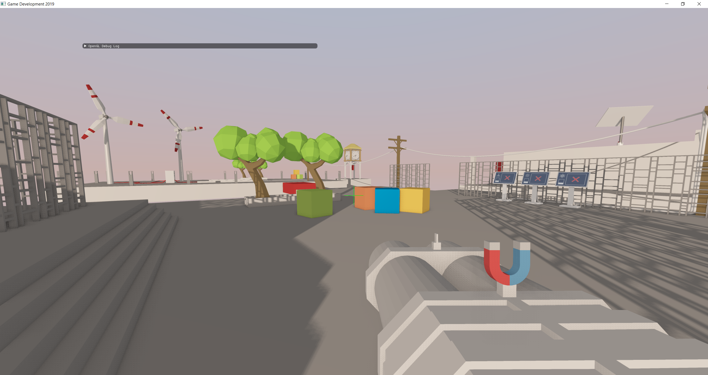
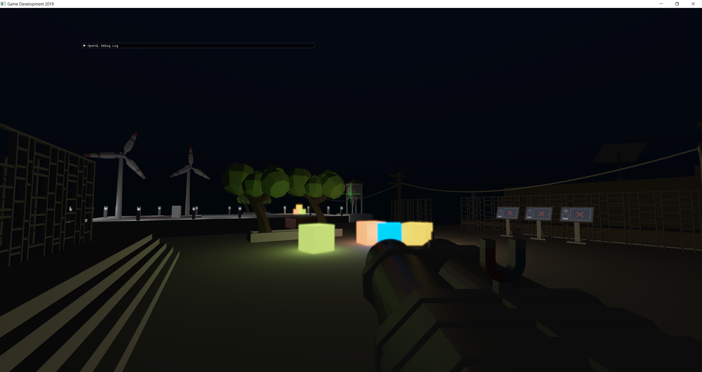
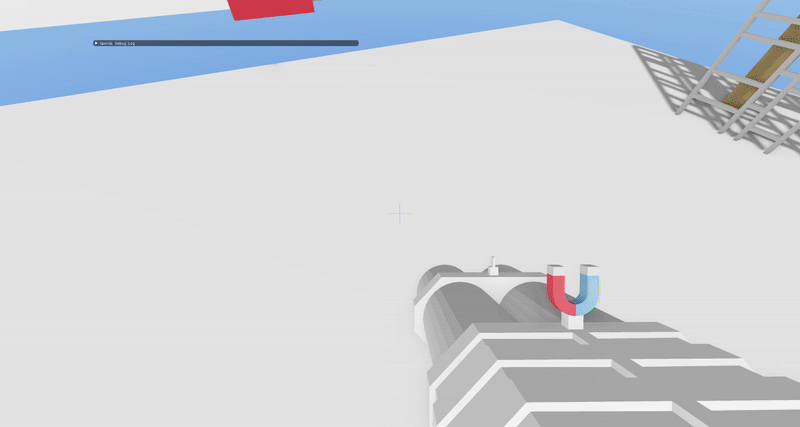
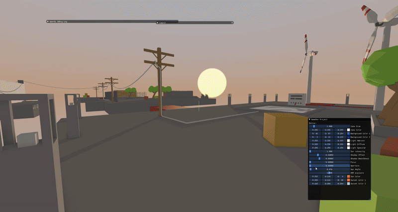

# GameDevelopment Practical 2019

## About

This project is a custom game engine featuring a magnet puzzle game where players use magnetic forces to solve challenging puzzles. The game serves as a showcase for various advanced graphics algorithms and rendering techniques.

### Key Features

- **Magnetic Physics**: Realistic magnetic field interactions and physics simulation
- **Advanced Lighting**: Dynamic sun progression with realistic day/night cycles
- **Shadow Mapping**: Real-time dynamic shadow rendering
- **Post-Processing Effects**: Bloom effects for enhanced visual quality
- **Anti-Aliasing**: Smooth edge rendering for crisp visuals
- **Accurate Physics**: Bullet Physics integration for realistic object interactions
- **Custom Shaders**: Extensive shader system for various visual effects

### Screenshots

### Gameplay Demo

## Building the project (with QtCreator on Linux)

Open `CMakeLists.txt` with `qtcreator`.

A modern QtCreator will ask you to configure the project.
You can choose the compiler (Clang and GCC work) and which targets to build (Release and Debug are sufficient).

The hammer icon in the bottom-left corner will build your project (shortcut Ctrl-B).

Before you can run the project you have to setup the Working Directory and the command line arguments.
Go to the `Projects` tab (on the left side) and choose `Run` of your current kit (on the top).
The working directory will be `REPO-DIR/bin/(Debug|Release)/` (depending on your configuration) but you have to *change* it to `REPO-DIR/bin`.

## Building the project (with Visual Studio 2017, on Windows)

Requirements:

* Visual Studio 2017 (C++)
* CMake 3.8+

Steps:
* Open CMake-Gui and enter the directory of the source code.
* Now specify where to build the project (this should *not* be inside the git repository).
* Click "Generate", choose "Visual Studio 15 2017 Win64" as the generator.
* Open the .sln file in the build folder with Visual Studio.
* Set GameDevSS19 as the Startup Project (right-click on the project -> Set as StartUp Project)
* Set working directory to the bin folder (right-click project -> Properties -> Debugging -> Working Directory), `$(TargetDir)/../` should work.
* Build the project
